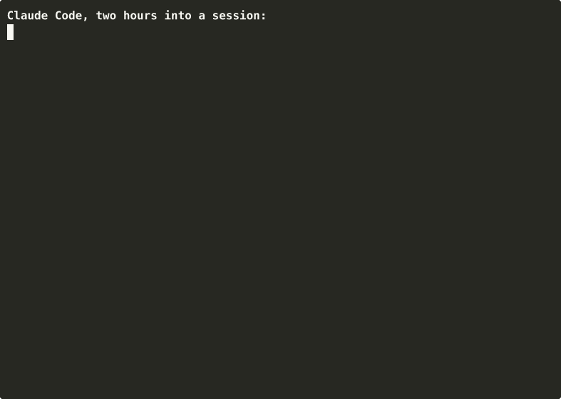

# The Behavior Floor

**Your instructions, actually enforced. A free rules floor for Claude Code that survives long sessions and compaction.**

Works on **Windows, macOS, and Linux** (all three verified). Requires Claude Code and Python 3.7+; standard library only, no API key, no network calls.



## What actually changes

Three everyday scenarios, before and after the floor:

- **You ask "why is this failing?"** Without: the agent starts editing files. With: you get an answer and nothing gets touched; action waits for an instruction.
- **A task fails.** Without: mockups or placeholder output dressed up as success. With: failure reported as failure, then it stops.
- **The agent decides a file is stale.** Without: hard delete, gone. With: everything moves to a dated `.trash/` folder that only you empty.

## Why this exists

A `CLAUDE.md` degrades. As context grows the model attends to it less; after `/compact` it fades further; by hour two the agent is padding answers, inventing fallbacks, and deleting things you never approved. The fix is not better prose, it is re-injection: this plugin hooks `SessionStart` to reload the full rules floor every session (fresh, resumed, or compacted) and injects a one-line style digest at every prompt, so the discipline sits at recency instead of dying at the top of the context.

The rules are not theory. They are the working floor of a production multi-agent system, run daily, with the operator-specific parts stripped. Plain text, standard-library Python, no API key, no network calls, auditable in five minutes.

Most agent tooling solves memory and orchestration. This supplies the layer underneath: how the agent behaves when nobody is watching.

This plugin is the free, standalone slice of the larger `Ktisis Arche` system. It works on its own. The full kit adds memory, orchestration, installation automation, a Claude-or-Codex switch, and the written guide behind the design.

## What is included

- Always-on non-negotiables in `rules/MEMORY.md`.
- Communication invariants and audience profiles in `rules/comms/`.
- Delegation doctrine in `rules/CONTEXT.md` and `rules/AGENT_TEMPLATE.md`.
- Editable persona templates in `templates/persona/`.
- Session hooks and namespaced slash commands for Claude Code.

This is a focused behavior floor, not the largest free agent framework. Mature community frameworks offer more features. This wins on coherence and doctrine, not feature count.

## Install

Add the repository as a marketplace, install the plugin, then reload plugins:

```text
/plugin marketplace add AlexanderGRTCh/behavior-floor
/plugin install behavior-floor@ktisis-arche
/reload-plugins
```

Restart Claude Code instead of running `/reload-plugins` if preferred. When prompted during installation, choose the scope that matches where you want the plugin available.

## What gets injected

- `SessionStart` runs on a fresh, resumed, or compacted session. It injects `rules/MEMORY.md` and `rules/comms/CORE.md`, with the status message `Loading behavior floor...`.
- `UserPromptSubmit` runs for each prompt. It injects the short `rules/comms/DIGEST.md` style reminder at recency.
- `/behavior-floor:rules` reasserts `MEMORY.md` after drift.
- `/behavior-floor:comms [chat|docs|published-copy]` loads an audience profile.
- `/behavior-floor:floor [lite|full]` loads persona context, plus delegation context at the `full` tier.

The hook uses Python 3.7 or newer and only the standard library. Its command tries `python`, then `python3`, then the Windows `py` launcher, so it works whichever alias your OS provides (verified on Windows, Debian Linux, and macOS). If no Python is found the hook fails silently and your session continues without the floor. Context overhead is roughly 2k tokens once per session plus about 60 tokens per prompt.

## Customize the persona

Edit these files in your installed or development copy:

- `templates/persona/SOUL.md` defines character, values, and boundaries.
- `templates/persona/IDENTITY.md` defines the assistant's name and voice.
- `templates/persona/USER.md` describes who the assistant serves and your preferences.

Fill the placeholders, remove the instructional comments, then run `/behavior-floor:floor lite`. Reinstall or update the marketplace copy if your Claude Code installation caches plugin files.

## Free vs paid, honestly

The free plugin includes the rules floor, communication doctrine, delegation doctrine, persona templates, hooks, and slash commands. The paid `Ktisis Arche` kit adds a persistent local memory engine, episodic extraction, a procedural rule seed pack, orchestration, installation automation, a working Claude-or-Codex switch, and the guide explaining why each layer exists, what failed before it, and when to break the rule.

The guide is the reason it costs money. The files are the demo; the reasoning is the product.

Founder price $29 (settling to $49): [paid kit link]

## FAQ

**Does it conflict with my CLAUDE.md?** No. Your CLAUDE.md still loads normally; the floor layers under it and, unlike a CLAUDE.md, gets re-asserted at every session start and every prompt, so it keeps working after compaction.

**What does it cost in tokens?** Roughly 2k once per session plus about 60 per prompt. The answer-first and condensation rules typically save more output tokens than that.

**Does it send my data anywhere?** No. Zero network calls; one standard-library Python script and plain-text rules you can audit in five minutes.

**How do I get rid of it?** One command: `/plugin uninstall behavior-floor@ktisis-arche`. Your system is back to exactly what it was.

## Uninstall

Run `/plugin uninstall behavior-floor@ktisis-arche`. Remove the `ktisis-arche` marketplace separately if you no longer use anything from it.

## License

MIT. Free to use and adapt in your own work. See [LICENSE](LICENSE).

## Trademarks

`Ktisis Arche` is an independent product and is not affiliated with, sponsored by, or endorsed by Anthropic or OpenAI. Claude, Claude Code, Codex, and other product and company names belong to their respective owners and are used only for identification and compatibility.
